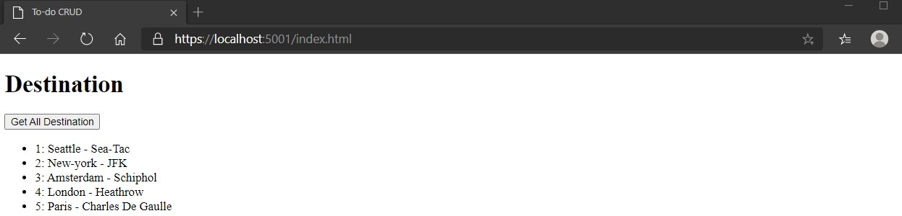

# Module 3: Creating and Consuming ASP.NET Core Web APIs

# Lesson 3: Consuming ASP.NET Core Web APIs 

### Demonstration: Consuming Services by Using JavaScript

- Abrimos el proyecto proyecto JavaScriptClient en Visual Studio Code 
- Restauramos el proyecto
- Añadimos un boton en el index.html
- Añadimos una funcion en el fichero Client.js
- Ejecutar

